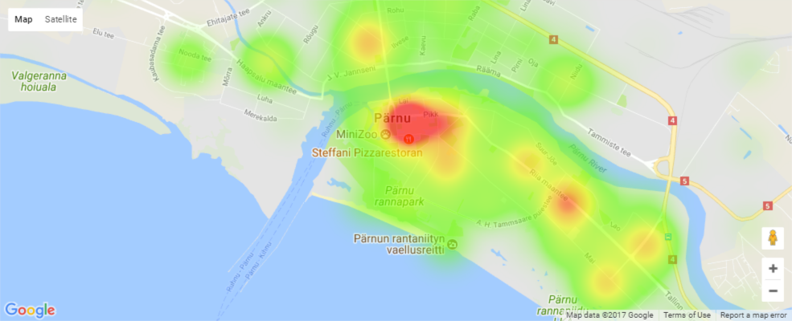

## Simple heatmap
A simple heatmap for offences against property and public crimes in Estonia 2016-2017 based on datasets: 

| Dataset    | Source                                         |
| ---------- | ---------------------------------------------- |
| *vara_1*   | https://opendata.smit.ee/ppa/csv/vara_1.csv    |
| *avalik_1* | https://opendata.smit.ee/ppa/csv/avalik_1.csv  |
 
A Python script to convert L-Est coordinates to WGS84 coordinates is also included (`lest_converter.py`).

## Example screenshots
### Estonia

### Harju county

### Tallinn

### Tartu

### Pärnu

### Õismäe and Mustamäe

